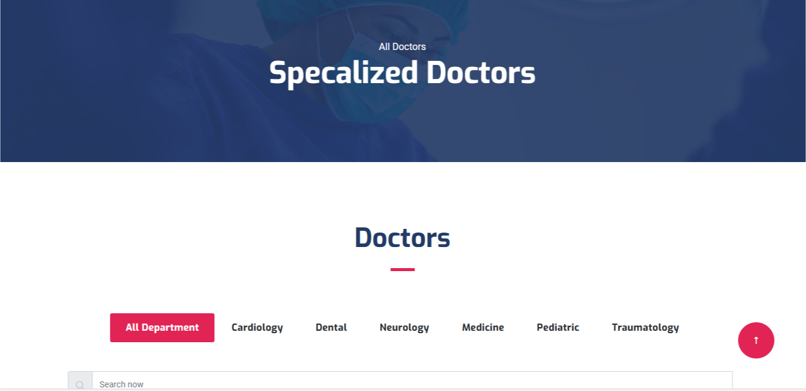

# PPE-PROJECT-MEDI-CARE

This Angular application allows patients to easily schedule appointments with doctors. Patients can view available doctors and book an appointment at a convenient time. The app provides a user-friendly interface for both patients and doctors, helping to streamline the appointment booking process.

This project was implemented as part of my PPE project at Sesame University. The main goal was to work with an Angular template and practice Angular features, gaining hands-on experience in building dynamic and interactive web applications.

## Demo



## Steps to Install and Run the Project

1. **Clone the repository**:
   - First, clone the repository to your local machine using:
     ```bash
     git clone https://github.com/PPE-PROJECT-Medi-Care/front-end-ppe-project.git
     ```

2. **Install dependencies**:
   - Install the required packages using npm:
     ```bash
     npm install
     ```

3. **Run the app**:
   - After installing the dependencies, run the app in development mode with:
     ```bash
     npm start
     ```
   - Open your browser and visit [http://localhost:4200](http://localhost:4200) to see the app in action.
   - The page will reload automatically when you make changes. You’ll also see any lint errors in the console.
